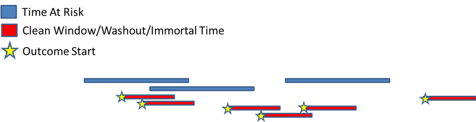
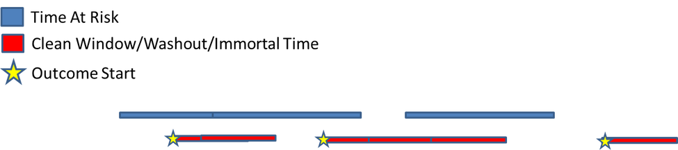
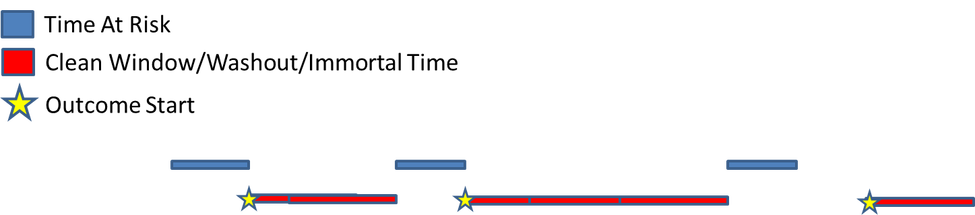
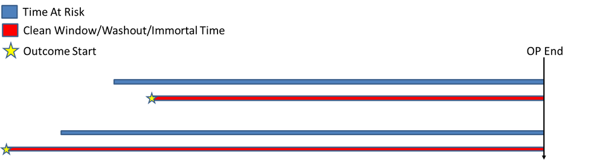

```{r setup, include=FALSE}
knitr::opts_chunk$set(echo = TRUE)
```

## Background

The incidence calculation method of CohortIncidence supports multiple cohort episodes per person and multiple outcomes per person, and accounts for immortal time from outcomes and clean windows.  This article describes the methods of excluding immortal time from time-at-risk, and the calculations behind the incidence rate and incidence proportion statistics.


## Terminology

When describing the CohortIncidence method, there are several key concepts to understand:

- cohort: a group of people satisfying clinical criteria for a period of time. This could be patients exposed, or patients diagnosed (among other types of cohorts)
- target cohort: The cohort that represents the population of interest to calculate incidence for.
- time at risk: The period of time relative to a person's cohort episode that the person is at risk of an outcome. For example, 'on treatment' is from the exposure cohort's start to end date, while 'intent to treat' is from exposure start to 9999 days after exposure start (ie: all time after exposure)
- outcome: the cohort that represents the cases to look for during time at risk, plus a clean window specification indicating the time after an case where another new case can be counted.  Since the clean window prevents new outcomes, the person's time at risk is excluded during the period of the clean window.
- case:  A case is counted when an outcome is found to begin during the time at risk.
- incidence proportion:  the number of people with at least 1 case divided by the number of people who have at least 1 day at risk. (persons with cases / persons at risk)
- incidence rate: the number of cases divided by total time at risk.  (cases / time at risk)

Incidence proportion is reported as 'per 100 people', and Incidence rate is reported as 'per 100 person years'.

## Example: Calcuating incidence from a single patient timeline

### Step 1: Define TAR and Clean Windows

The figure below represents a single person in the target cohort with 3 episodes of a treatment, and the time-at-risk specification extending the first episode into the second.   This person also has 6 outcome events represented by the gold stars, and the clean window extending from each outcome, causing time at risk to be excluded and certain outcomes to be ignored.


Figure 1: The initial intervals of time-at-risk, outcomes and clean windows.

### Step 2: Collapse TAR and Clean Windows

Overlapping intervals of TAR and clean windows need to be 'flattened' and outcomes that occur during clean windows are removed.  After this is done, the person TAR, clean window and outcomes look like the following figure: 

Figure 2: Merging TAR and clean windows, and removing outcomes from clean windows.

### Step 3: Remove Immortal Time

With the time at risk and clean windows merged, all time at risk that overlaps with clean window periods are removed from the person.  The result looks like the following:

Figure 3: TAR excluded from patient timeline.

### Step 4: Calculate Incidence Rate and Proportion

With the TAR cleaned up, the final timeline is used to calculate the incidence rates and proportions:


Figure 4: The final timeline used to calculate incidence.

Incidence Rate = cases / TAR.  In this example, there are only 2 cases during TAR.
Incidence Proportion = (distinct people with cases) / (distinct people).  This person contributes one person count and one person with case count.

## Limiting follow up to first outcome

Some analytic use cases call for only following the patient until the first outcome.  This means, in a CohortIncidence context, that after an outcome, no further outcomes are allowed and no post-outcome time-at-risk should be counted.  This is handled by setting a '9999' clean window so that all time after an outcome is excluded.



Note: using this approach will exclude anyone with a prior outcome, since their time-at-risk will be completely excluded.  In order to ignore prior outcomes but exclude all time after the first outcome after exposure, a specialized 'O-with-prior-T' outcome cohort is required that will only capture outcomes that occur post-T.

##  A Tabular Example

The following table represents a data set of calculated time at risk, cases, and calculated rates/proportions:

| person_id | time_at_risk_pe | time_at_risk | cases_pe | cases |
|-----------|-----------------|--------------|----------|-------|
|     1     |       365       |      365     |    0     |   0   |
|     2     |       365       |       0      |    1     |   0   |
|     3     |       365       |      120     |    2     |   1   |

In this example, person 1 has no time-at-risk excluded, and zero cases.  Person 2 has all time-at-risk excluded (from a clean window) with a case pre-exclude (pe), but no cases after time-at-risk was excluded.  Person 3 has part of their time-at-risk excluded, with 1 actual case (1 case was during a clean window).

Persons at risk = 2 (person 2 contributed zero time-at-risk, so is not included in this count)

Total time-at-risk = 485d (sum of time_at_risk)

Persons with cases = 1

cases = 1

Calculations:

incidence proportion (persons per 100 persons): (persons with cases / persons at risk) * 100.0
1/2 * 100.0 = 50%

incidence rate (cases per 100 person years): (cases / (time at risk / 365.25)) * 100.0 
1/(485/365.25) * 100.0 = 75.3 cases per 100 person years.

